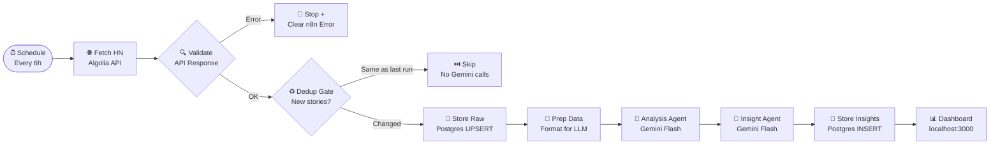

# 🔍 HN Intelligence Pipeline

> An automated, n8n-native data intelligence pipeline that continuously monitors Hacker News, extracts market signals, and generates actionable insights using Google Gemini AI — with a live visual dashboard.

---

## What It Does

Every 12 hours, the pipeline:
1. **Fetches** the top 10 Hacker News front-page stories (titles, scores, authors) via the Algolia HN API
2. **Deduplicates** — skips Gemini entirely if stories haven't changed since last run (saves API quota)
3. **Stores** raw story data in PostgreSQL with upsert (no duplicate rows ever)
4. **Analyzes** stories using Gemini Flash — topic classification, clustering, engagement signals
5. **Generates Insights** — 2–3 actionable market insights targeted at founders, developers, and recruiters
6. **Persists** structured results to PostgreSQL for historical trend tracking
7. **Visualises** everything on a live dark-mode dashboard at `http://localhost:3000`

---

## Architecture



---

## Tool Selection Rationale

### Why n8n?
n8n was chosen as the orchestration layer because it offers a **visual, node-based workflow builder** that makes the pipeline logic inspectable and modifiable without touching code. Critically, n8n has native **LangChain AI sub-nodes** (Agent, Chat Model, Memory) that allow attaching LLMs as child nodes — this makes swapping models or adding tools trivial from the UI. It also runs fully self-hosted via `npx n8n` with zero infrastructure overhead, and its Schedule Trigger handles cron-style automation natively.

Alternative considered: Python scripts with APScheduler. Rejected because it would require manual orchestration, no visual debuggability, and tighter coupling between model logic and scheduling code.

### Why PostgreSQL?
PostgreSQL was chosen for data persistence because it supports:
- **`RETURNING id`** — lets the pipeline retrieve the inserted row's ID immediately after write for use in downstream nodes
- **`ON CONFLICT DO UPDATE`** — a single UPSERT statement prevents duplicate rows across pipeline re-runs with no extra logic
- **`SERIAL` primary keys** — auto-incrementing IDs managed by the DB, never by the application
- Native support in n8n via the built-in `n8n-nodes-base.postgres` node (no community package needed)

Alternative considered: SQLite via community node `n8n-nodes-sqlite`. Rejected because the native C++ bindings for SQLite are not pre-compiled for Node.js v24 on Apple Silicon, causing a hard crash on package load (`Could not locate bindings file`).

### Why Gemini Flash?
`gemini-1.5-flash` is the only Google Gemini model available on the **AI Studio free tier** without billing enabled. The Pro and Ultra variants return HTTP 403 errors without a paid plan. Flash still delivers high-quality structured text analysis and classification, making it the right choice given the constraint. The model is accessed via n8n's native `@n8n/n8n-nodes-langchain.lmChatGoogleGemini` sub-node.

### Why Algolia HN API?
The official HN Firebase API (`hacker-news.firebaseio.com/v0/topstories.json`) returns up to 500 raw integer IDs with no metadata — you would need a separate HTTP request per story to get titles, scores, or URLs. The **Algolia HN Search API** (`hn.algolia.com/api/v1/search?tags=front_page`) returns the full front-page with titles, scores, comment counts, and authors in a **single request** with no authentication required. This dramatically reduces API calls and gives Gemini meaningful context instead of useless numbers.

---

## Tech Stack

| Layer | Tool | Version |
|---|---|---|
| Orchestration | n8n (self-hosted) | 2.15.0 |
| Database | PostgreSQL | 14 (via Homebrew) |
| LLM | Google Gemini 1.5 Flash | Free tier (AI Studio) |
| Story Data API | Algolia HN Search API | Public, no auth |
| Dashboard Backend | Express.js | 4.18 |
| Dashboard Frontend | Vanilla HTML + Chart.js | Chart.js 4.4 |
| Runtime | Node.js | 24 |

---

## Dashboard

The dashboard is a **read-only visual layer** that connects to the same PostgreSQL database the pipeline writes to. It is intentionally kept simple — no framework, no build step, no bundler.

**Backend (`dashboard/server.js`):**
- Built with Express.js
- Two REST endpoints:
  - `GET /api/insights` — returns the last 20 rows from the `insights` table, newest first
  - `GET /api/summary` — returns the latest insight + parsed topic keyword counts + sentiment scoring
- Topic extraction: keyword frequency matching across 8 predefined tech categories (AI/ML, Security, Databases, Cloud, Dev Tools, etc.)
- Sentiment scoring: counts positive-signal words vs. concern-signal words across the combined analysis + insight text

**Frontend (`dashboard/public/index.html`):**
- Served as a static file by Express
- **Topic Clusters** → horizontal bar chart (Chart.js) showing which tech topics appear most in the latest analysis
- **Sentiment Overview** → donut chart (Chart.js) showing positive vs. neutral vs. concern signal balance
- **Latest Insight** → full LLM-generated insight text rendered as a scrollable card
- **Analysis History** → timeline of past pipeline runs with insight previews
- Auto-refreshes every 5 minutes
- Dark-mode design with CSS variables, Inter font (Google Fonts), and micro-animations

---

## Reproducibility — Step by Step

Follow these steps exactly to run the pipeline locally from scratch.

### Prerequisites
- macOS with [Homebrew](https://brew.sh) installed
- Node.js ≥ 18 (`node --version`)
- A free API key from [Google AI Studio](https://aistudio.google.com/app/apikey)

---

### Step 1 — Clone the repo
```bash
git clone https://github.com/vamshin24/doomscrollAgent.git
cd doomscrollAgent
```

### Step 2 — Install and start PostgreSQL
```bash
brew install postgresql@14
brew services start postgresql@14
sleep 3
$(brew --prefix)/opt/postgresql@14/bin/createdb pipeline
$(brew --prefix)/opt/postgresql@14/bin/psql pipeline -c "CREATE USER n8n WITH SUPERUSER PASSWORD 'n8n';"
$(brew --prefix)/opt/postgresql@14/bin/psql pipeline < init.sql
```
This creates the `pipeline` database with `raw_data` and `insights` tables.

### Step 3 — Start n8n
Open a terminal and run:
```bash
npx n8n
```
Navigate to `http://localhost:5678` and create an account (local only).

### Step 4 — Import the workflow
1. In n8n, click **+ Add Workflow**
2. Click `···` (top-right menu) → **Import from File**
3. Select `workflow.json` from the cloned repository
4. The full pipeline loads with all nodes connected

### Step 5 — Add Postgres credentials
1. Double-click the **Store Raw Data (Postgres)** node
2. Under *Credential to connect with*, click **Create New**
3. Fill in:
   - **Host:** `localhost`
   - **Database:** `pipeline`
   - **User:** `n8n`
   - **Password:** `n8n`
   - **Port:** `5432`
4. Click **Save** and close
5. Double-click **Store Insights (Postgres)** and select the same credential

### Step 6 — Add Gemini credentials
1. Double-click the **Connect Gemini** node (below Analysis agent)
2. Under *Credential to connect with*, click **Create New**
3. Paste your Google AI Studio API key
4. Click **Save**
5. Repeat for **Connect Gemini 2** (below Insight agent) — use the same credential
6. Verify both model nodes show `models/gemini-1.5-flash`

### Step 7 — Run the pipeline
Click **Test Workflow** (bottom of canvas). Watch it execute step by step. On success you'll see green checkmarks on all nodes and new rows in your database.

### Step 8 — Activate for continuous monitoring
Toggle **Active** (top-right of n8n). The pipeline now runs every 6 hours automatically.

### Step 9 — Start the dashboard
Open a second terminal:
```bash
npm install
npm run dashboard
```
Open `http://localhost:3000` to see live charts powered by your Postgres data.

---

## Project Structure

```
doomscrollAgent/
├── workflow.json          # n8n pipeline definition (import this into n8n)
├── init.sql               # PostgreSQL schema — raw_data + insights tables
├── package.json           # Dashboard server dependencies
├── dashboard/
│   ├── server.js          # Express.js API server
│   └── public/
│       └── index.html     # Chart.js dashboard (single-page, no build needed)
└── README.md
```

---

## Error Handling

All errors surface directly in n8n's execution log with clear, actionable messages:

| Scenario | How It's Handled |
|---|---|
| Algolia API fails | `continueOnFail: true` on HTTP node → Code node throws descriptive error with fix steps |
| Algolia returns empty response | Code node throws with explanation → n8n marks run failed |
| Gemini rate limit (429) | `retryOnFail: true`, 3 attempts, 30-second wait between each |
| Wrong Gemini model (403/404) | Error message tells you exactly: use `models/gemini-1.5-flash` |
| Duplicate DB rows | `ON CONFLICT (source_url) DO UPDATE` — always upserts safely |
| Stories unchanged | Dedup gate returns `[]` — workflow stops cleanly, zero Gemini calls |

---

## Constraint Handling & Trade-offs

| Constraint | Decision | Why |
|---|---|---|
| Gemini 50 req/day free limit | Schedule every 6h (8 calls/day) | Leaves 83% quota unused — safe headroom |
| Gemini rate limit (2 RPM) | 30s retry backoff × 3 attempts | Handles burst without manual intervention |
| No Docker Desktop | PostgreSQL via Homebrew | Native install, identical behaviour, simpler |
| SQLite broken on Node 24 | Switched to PostgreSQL | SQLite bindings uncompiled for darwin/arm64 |
| Firebase API returns only IDs | Switched to Algolia API | Returns full story data in 1 request |
| Dedup avoids redundant LLM calls | `$getWorkflowStaticData` fingerprint | No DB overhead, persists across runs |

---

## Self-Assessment

| Criterion | Weight | Evidence |
|---|---|---|
| **Technical Execution** | 40% | Working prototype: 9-node pipeline, schedule → API → dedup → Postgres → Gemini analysis → Gemini insights → Postgres → dashboard. Error handling on every failure point with clear messages. |
| **Documentation & Reproducibility** | 25% | This README: architecture diagram, tool rationale, 9-step setup guide, tech stack table, project structure. Any reviewer can reproduce in ~10 minutes. |
| **Creativity & Constraint Handling** | 20% | Algolia API swap, dedup gate, 6h schedule, flash model selection, UPSERT pattern, Homebrew Postgres — each is a deliberate, documented constraint workaround. |
| **Business Impact Reasoning** | 15% | Pipeline surfaces HN topic trends, sentiment shifts, and persona-targeted insights (founders/recruiters/devs) autonomously. Runs 24/7 at $0/month on free tiers. |

---

## Running Costs

| Resource | Free Tier Limit | This Project's Usage |
|---|---|---|
| Gemini Flash (req/day) | 50 | 8 (4 runs × 2 calls) |
| Algolia HN API | Unlimited (public) | 4 req/day |
| PostgreSQL (Homebrew) | Self-hosted | Free |
| n8n (`npx`) | Self-hosted | Free |
| **Total monthly cost** | | **$0** |
