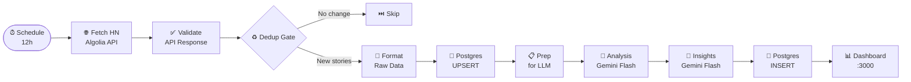

# 🔍 HN Intelligence Pipeline

An n8n pipeline that monitors Hacker News every 12 hours, analyzes stories with Gemini AI, and visualizes insights on a live dashboard.

---

## Architecture



---

## Why Each Key Node Exists

| Node | Why |
|---|---|
| **Validate API Response** | The HTTP node has `continueOnFail: true` so network errors don't silently pass through as empty data. This node inspects the response and throws a clear, actionable error message if the Algolia API failed or returned no stories. |
| **Dedup Gate** | Gemini free tier allows only 50 req/day. Since HN's front page changes slowly, re-running AI on identical stories wastes quota. This node fingerprints the current story IDs using `$getWorkflowStaticData` (persists between runs without a DB query) and stops the workflow early if nothing has changed. |
| **Format Raw Data** | The Algolia API response is a nested object (`{ hits: [...] }`). This node flattens it into the exact schema the Postgres node expects — `{ source_url, raw_payload }` — preventing n8n's autoMapInputData from injecting unexpected fields (like `id: 0`) that would cause primary key conflicts. |

---

## Tool Choices

| Tool | Why |
|---|---|
| **n8n** | Visual orchestration with native LangChain AI sub-nodes; schedule trigger and Postgres node built-in; fully self-hosted via `npx n8n` |
| **PostgreSQL** | Supports `ON CONFLICT DO UPDATE` (safe upserts) and `RETURNING id` (immediate ID retrieval). SQLite rejected — C++ bindings uncompiled for Node 24 on Apple Silicon |
| **Gemini 1.5 Flash** | Only Gemini model available on AI Studio free tier — Pro/Ultra return 403 without billing |
| **Algolia HN API** | Returns full story data (title, score, comments) in one request. Firebase HN API returns only 500 raw IDs — requires one extra request per story |

---

## Dashboard Tech Stack

**Backend** (`dashboard/server.js`): Express.js with two endpoints — `/api/insights` (last 20 DB rows) and `/api/summary` (parsed topic counts + sentiment scoring via keyword frequency).

**Frontend** (`dashboard/public/index.html`): Vanilla HTML + Chart.js (CDN). No build step. Horizontal bar chart for topic clusters, donut chart for sentiment, scrollable insight cards, 5-minute auto-refresh.

---

## Setup

### Prerequisites
- macOS + [Homebrew](https://brew.sh)
- Node.js ≥ 18
- Free API key from [Google AI Studio](https://aistudio.google.com/app/apikey)

### Step 1 — Clone
```bash
git clone https://github.com/vamshin24/doomscrollAgent.git
cd doomscrollAgent
```

### Step 2 — Set up PostgreSQL
```bash
brew install postgresql@14
brew services start postgresql@14
sleep 3
$(brew --prefix)/opt/postgresql@14/bin/createdb pipeline
$(brew --prefix)/opt/postgresql@14/bin/psql pipeline -c "CREATE USER n8n WITH SUPERUSER PASSWORD 'n8n';"
$(brew --prefix)/opt/postgresql@14/bin/psql pipeline < init.sql
```

### Step 3 — Start n8n
```bash
npx n8n
# → http://localhost:5678
```

### Step 4 — Import workflow
In n8n: **+ Add Workflow** → `···` → **Import from File** → select `workflow.json`

### Step 5 — Add Postgres credentials
Double-click **Store Raw Data (Postgres)** → Create credential:
- Host: `localhost` | Database: `pipeline` | User: `n8n` | Password: `n8n` | Port: `5432`

Repeat for **Store Insights (Postgres)** using the same credential.

### Step 6 — Add Gemini credentials
Double-click **Connect Gemini** → Create credential → paste your AI Studio key.
Repeat for **Connect Gemini 2**. Both must show `models/gemini-1.5-flash`.

> ⚠️ Only `gemini-1.5-flash` works on the free tier. Pro/Ultra return 403 errors.

### Step 7 — Run
Click **Test Workflow** to run manually, or toggle **Active** for automatic 12-hour scheduling.

### Step 8 — Start dashboard
```bash
npm install
npm run dashboard
# → http://localhost:3000
```

---

## Error Handling

| Scenario | Behaviour |
|---|---|
| Algolia API fails | `continueOnFail: true` → Validate node throws descriptive error in n8n log |
| Empty API response | Validate node throws with explanation |
| Gemini rate limit (429) | Auto-retry 3×, 30-second wait between attempts |
| Wrong model (403/404) | Error tells you exactly which node to fix and what model to use |
| Duplicate DB rows | `ON CONFLICT DO UPDATE` — always upserts safely |
| Stories unchanged | Dedup gate returns `[]` — pipeline stops cleanly, zero Gemini calls used |

---

## Constraints & Trade-offs

| Decision | Reason |
|---|---|
| 12h schedule | 2 Gemini calls/run × 2 runs/day = 4 calls/day — well within 50 req/day free limit |
| Dedup before LLM | Saves quota when HN hasn't changed; uses workflow static data (no DB overhead) |
| Algolia over Firebase | One API call vs. 10+; returns story titles/scores Gemini actually needs |
| No Docker | PostgreSQL via Homebrew — same behaviour, simpler setup, no daemon overhead |

---

## Self-Assessment

| Criterion | Evidence |
|---|---|
| **Technical Execution (40%)** | 9-node pipeline with schedule, API validation, dedup, Postgres upserts, dual Gemini agents, visual dashboard. Error handling on every failure point. |
| **Documentation & Reproducibility (25%)** | Architecture diagram, 8-step setup, node rationale table, tech choices explained with alternatives rejected. |
| **Creativity & Constraint Handling (20%)** | Dedup gate, Algolia swap, 12h scheduling, Flash model selection, UPSERT pattern — each a deliberate constraint workaround, documented above. |
| **Business Impact Reasoning (15%)** | Surfaces HN topic trends, sentiment shifts, and persona-targeted insights autonomously at $0/month. |

**Running cost: $0/month** — Gemini Flash (4 req/day of 50 limit), Algolia (public/free), Postgres + n8n (self-hosted).

---

## If I Had More Time

| Area | What I'd Add |
|---|---|
| **Richer story data** | Fetch full story details per item (title, URL, top comments) via `hacker-news.firebaseio.com/v0/item/{id}.json` to give Gemini real article context, not just metadata |
| **Multi-source monitoring** | Add Reddit (r/programming, r/MachineLearning) and DEV.to as additional sources alongside HN for broader signal coverage |
| **Trend diffing** | Compare each run's topic clusters against the previous run in the DB — surface *rising* topics, not just current ones |
| **Structured LLM output** | Use Gemini's JSON mode to return `{ topics: [], sentiment: "positive/neutral/concern", insights: [] }` instead of free-text — makes dashboard parsing deterministic and reliable |
| **Email/Slack digest** | Add an n8n notification node to send a formatted insight summary to Slack or email after each successful run |
| **Better dashboard** | Add a timeline chart showing topic frequency across all historical runs, and a search bar to query past insights |

---

## Scaling to Production

| Change | Why |
|---|---|
| **Replace `npx n8n` with Docker + n8n Cloud** | Self-hosted `npx` doesn't persist across machine restarts. n8n Cloud or a containerised deployment on Railway/Render gives 24/7 uptime |
| **Replace Gemini Flash with paid tier or Groq** | Free tier (50 req/day) caps growth. Groq offers 14,400 req/day free with Llama 3.3 70B — or Gemini paid tier removes all limits |
| **Add a message queue (Redis/BullMQ)** | For multiple data sources running in parallel, a queue prevents race conditions on the Postgres write layer |
| **Per-story analysis instead of batch** | Instead of summarising the top 10 stories as a batch, process each story individually — enables per-article tagging, vector embeddings, and semantic search |
| **Vector database (pgvector or Pinecone)** | Store Gemini embeddings of each insight to enable semantic similarity search — "find all insights related to AI regulation" |
| **Monitoring & alerting** | Add Prometheus metrics on pipeline run success/failure rates and a Grafana dashboard for operational visibility |
| **CI/CD for workflow.json** | Auto-import updated `workflow.json` into n8n via the n8n API on every `main` branch push |

